**Document created**: *Sat 11 Jul 2026 14:02 PM GMT*  
**Document updated**: *Sat 11 Jul 2026 21:13 PM GMT*    

-----

# EXPLANATION of the Grep command  

Grep, is a command which can be used to find either:    
- a single character  
- single word  
- multiple words  
- a sentence  
- multiple sentences    

...within a file.     

Additionally, it can be used to search to find data included inside of any other file format, too:  

> grep searchTerm filename.data  
> grep searchTerm filename.html    
> grep searchTerm filename.json   
> grep searchTerm filename.toml   
> grep searchTerm filename.txt        
> grep searchTerm filename.xml  
> grep searchTerm filename.yml  
> grep searchTerm filename.(-etc.)   
...up to, and, including files without any *filename.extension*:   
> grep searchTerm filename  
...you can even search inside of *hidden* files/(*hidden* fileNames start with a period dot):      
> grep searchTerm .filename    

-----

# GREP: BASIC USAGE  

Grep's basic usage has 3 different forms:       

-----

A.

grep searchTerm filename.extension

Eg.

> grep NatWest phonebook.csv   

Output result:  

> **NatWest**, 0800 200 400, Bank  

-----

B. 

> cat filename.extension | grep searchTerm   

Eg.  

> cat phonebook.csv | grep 0800

Output result:  

> Nat West, **0800** 200 400, Bank  

-----

C.

**NOTE**: If there are multiple words being included inside of the search term,  
that are separated by either a space/or, spaces...;  
then, one has to include a pair of quote marks  
to go around the multiple words being used to search for.       

Eg.  

"word1 word2"  

> cat phonebook.csv | grep "West, 0800"    

Output result:  

> Nat **West, 0800** 200 400, Bank  

-----

## EXAMPLES

-----

### Example 1: Interrogating phonebook records stored in the form of a [.csv] file      

A real world example usage might be...  

I've created a simple comma separated values/[.csv] file called:   

> phone-numbers.csv     

I keep on adding more and more data to this phone numbers list   
so that it, slowly, *grows* over time...;   
to become a list of over 200+ names/phone numbers/categories.  

Rather than attempt to scroll down through the **full list**...;    
just to find the information I *need*;  
-(and, especially, if that information is found near the very bottom of the list...???)-;  
I call to the rescue: grep;  
which will do the 'relevant' searching for me;  
automatically, casting out any lines which *don't* match my chosen search criteria.       

> Name,Number,Category   
> Emergency,999,Help  
> Nat West,0800 200 400,Bank  
> Humpty Dumpty,1111 222 3333,Friend  
> Jane Doe,4444 5555 6666,Family  

The search query command goes as follows:  

> grep "Jane" phone-numbers.csv

...output result...

> **Jane** Doe,4444 5555 6666,Family

**NOTE**: How the found word is, already, *highlighted* in **bold** text effect.  

-----

### Example 2: Interrogating a Linux commandlet: hostnamectl  

I might have completely forgotten what was the exact *name/version* of my computer operating system;  
so, in order to find out this information, I use the command:    

> hostnamectl  

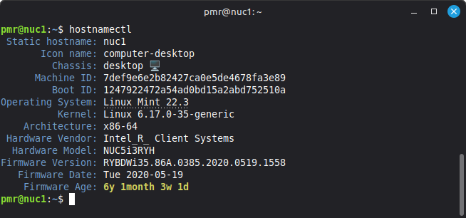  

...which provides the relevant info; though, in **long** listing format;    
giving me far more information than I do actually need.  

To *shorten* this information down...; I choose to use the Grep command, instead.  

> hostnamectl | grep "Operating System"  

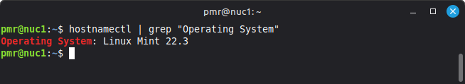  

-(**NOTE:** In the above case, you would already have to know that the words:   
**Operating System**    
...was already included inside of the file: hostnamectl;     
otherwise, including the *wrong* search term would result in the information NOT being found.     
However, once you've used: hostnamectl, before;  
then, this is a much *quicker* way to locate and find the precise information you need.)-         

-----

### Example 3: Interrogating through command line *history*  

I might have typed in a bash script command say whole days/weeks/months ago...;    
but, most unfortunately, I've now completely forgotten what was the exact command format I did previously use...?      
Therefore, I now wish to go and looking through command list **history**...; which can be very long, indeed...;    
rather than keep on scrolling endlessly *upwards and upwards*...???  
I just simply use 'grep' to find the **history** file lines that are relevant, instead.  

grep history source  

-----

### Example 4: Interrogating a single sentence/or, even, multiple sentences  

4a.  

Here, I'm using Grep command to discover how many o's there are in an admittedly *short* sentence;    
but, note, of course, that sentence could also have been written out to be much longer.  

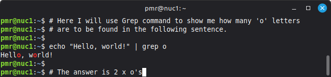  

4b.  

The same above file could be written as...this time using a variable to hold the text:    

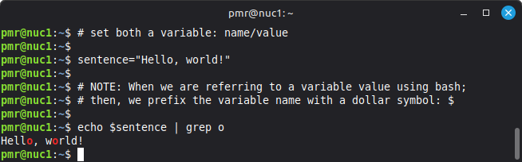  

4c.  

In this variation, a file is used to both write/store the text into...; then, the grep command is used to query that file's data:  

![grep command in action:find 'o' in text: [.txt] file](pictures/110726-1801-file-grep-o.png "printout:grep in action: find o in text: [.txt] file")  

4d.  

For a final variation I will open Linux text editor called: nano/   
and, create a file called: sentences.txt;   
which will be used to store multiple: 'Hello, world!'  

   

Next, I will type into Nano text editor 6 x 'Hello, world!';  
and, afterwards, save the file using: [CTRL] + [O], then, [X] to exit Nano;    
and, return back to the Terminal 'black' screen.    

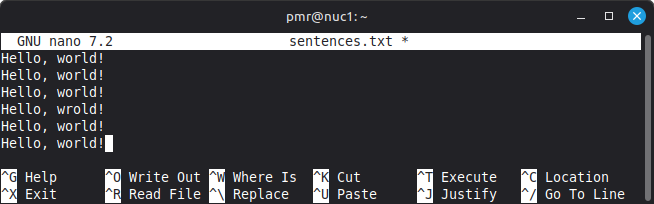   

Finally, I will run the file; and, use Grep to interrogate it:    

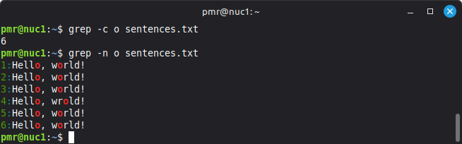   

**NOTE**: 

The switch: -c, counts up the number of lines in which the searched for text letter: 'o' was found;    
and, in this case, letter 'o' was found to be written on 6 separate lines.  

The switch: -n, is used to display both the actual line number/plus, the line itself.  

-----

### Example 5: Interrogating through a web page HTML file  

Grep, can be used to interrogate program files, as well.    
Why? Because program files are just merely *text files*.    
And, the **grep** command can be used to interrogate *any* text based file.    

In this case, the web page file is called:  

> webpage1.html  

...and, here is it's underlying *source code*:   

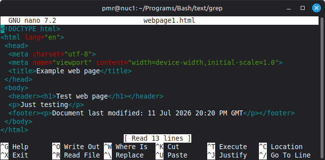   

I'm using this command to find the plain text(title):

> grep title webpage1.html  

...and, then, I'm using this command to find the tag name(<title>):  

> grep "<title>" webpage1.html  

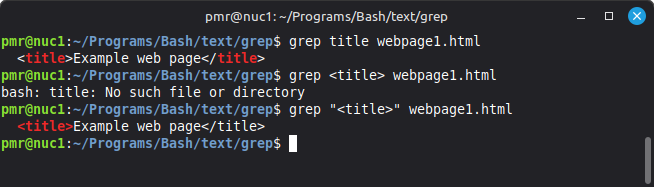   

**NOTE**: Because, *bash* code itself uses chevrons: (<>);   
therefore, in order to avoid any confusion between what is *bash* code/     
and, *text* I'm actually searching for...;  
therefore, it becomes necessary to place a pair of quote marks: ("") to go around the tag called: ("<title>");  
then, the search works without any errors appearing inside of the output.    

-----

**Summary**

Grep, can be used to search for words/or, even, sentences within a file.  

- To find just one single word...; then, you do NOT need to surround that word with a pair of double quotes:    

> grep word filename.extension  

- To find multiple words, which have spaces showing in between them,  
  then, you would have to use a pair of double quotes to go around the whole:  

> grep "two words" filename.extension   

-----

**Flags**

Grep, also, uses flags:  

-i, means ignore case (the casing can be either lower/or, upper casing/or, even, mixed casing...and grep will find it, anyway)  

-n, means show both the line number/together with the actual line that was found.      

**NOTE**: It is also possible to combine flags together as: -in (both ignore case/and, show line numbers)  

-c, counts up the number of lines which contained the search term.  

-----

**Tips**  

There is no need to keep on typing in the whole of the: filename.extension  

In the case of a file called: phonebook.csv  
 
You could choose to search using...  

> grep word p*.csv  

...and, this would find *any* file beginning with the letter: p.../and, ending with the filename extension: .csv  

-----

**CONCLUSION**  

The 'grep' command is a very powerful command when it comes to finding things such as text.  

There are many different variations on how it's possible to use it...; that is *limited* only by the users own 'imagination'...???  

As a beginner to using this command myself...; therefore, I can only claim to have merely *scratched the surface* on how to use 'grep';    
which means, that the examples included herein are not fully extensive at all; and, it's a guarantee that much has been left out.    

Also, I've included only a few of the possible switches you can use with the 'grep' command, including: -i/-c/-n/;  
but, I'm sure, there are many more switches, as well. 

If you wish to learn more...; then, I  would suggest you do a man -(manual)- page search for:  

> man grep

-----

# BASH Script: Demo: 1

**NOTE**: This particular script is NOT yet fully finished...;     
but, instead, is only just begin...I will add more parts to it, later on.  

I wish to add...  
- The user types in the name of the file they wish to query  
- The user also types in the term they wish to use to do the query with.   
...so, that the code can be run/used...without the end user needing to touch doing any coding themselves;  
meaning anybody should be able to use/run it...without needing to know any code.       

Use of the command: grep/plus, flags: -in

Listing *all* files:  

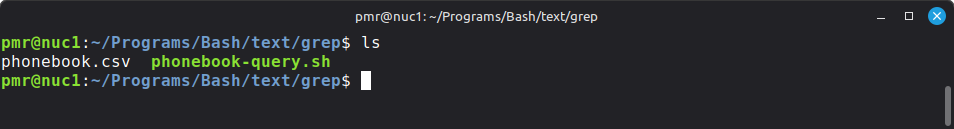   

First, create a Comma Separated Values [.csv] file, called:  

phonebook.csv   

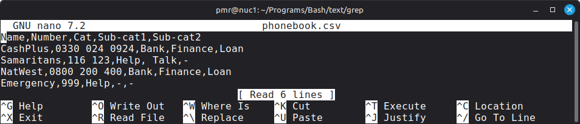  

Next, create a bash script to query/find certain specific data within that file, namely, the word: Finance     

phonebook-query.sh  

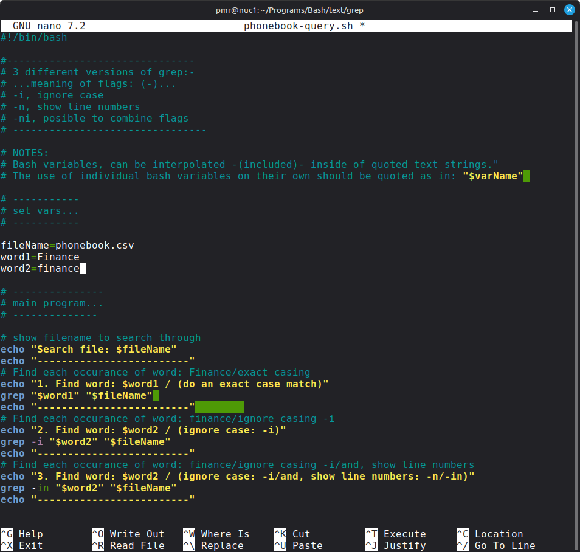  

Next, run the file:   

phonebook-query.sh  

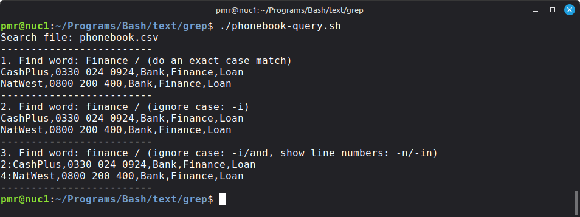  

